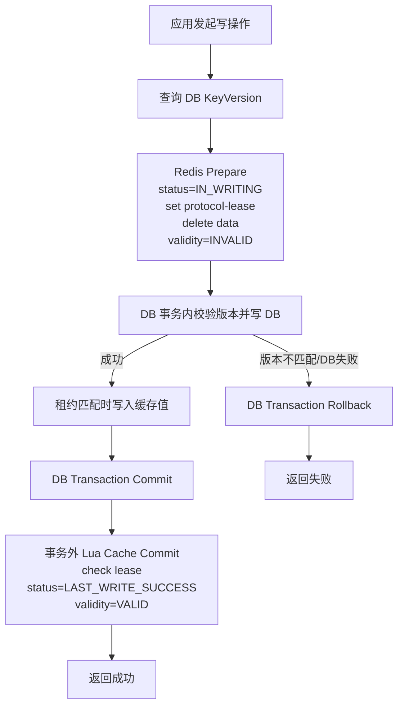
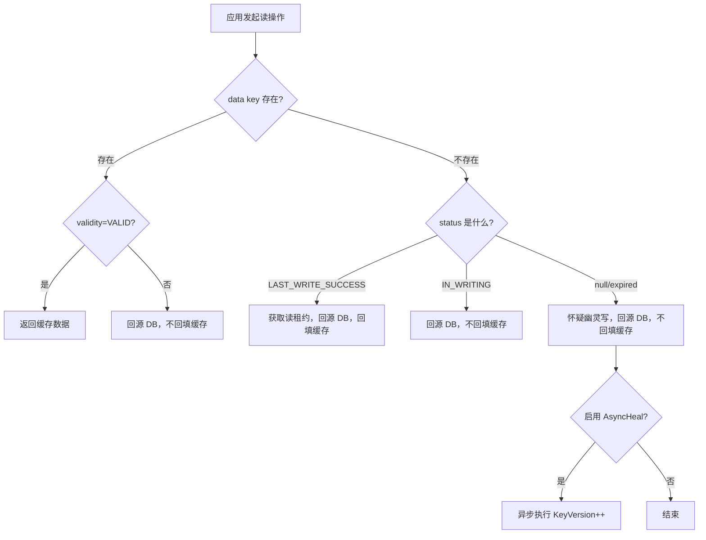

# Cache Consistency Kit

一个面向开源场景的缓存与数据库一致性基础库，提供基于 Redis 协议状态机的读写一致性控制，不依赖任何企业内部框架。

许可证：Apache-2.0，见 [LICENSE](LICENSE)。

## 项目定位

- 用标准 Redis 客户端实现协议，不绑定私有中间件
- 用 `PersistentOperation` / `TransactionalPersistentOperation` 适配 MySQL、PostgreSQL、MongoDB 或其他持久层
- 以“协议优先”方式处理写窗口、版本校验、缓存失效和幽灵写
- 提供可直接集成到 Spring 的标准 `FactoryBean`
- 提供 Spring Boot 自动配置和 Micrometer 指标接入

## 模块

- `consistency-core`：核心 API、协议模型、一致性客户端、Redis 适配接口
- `consistency-compensation`：可选补偿扩展，不属于默认协议主路径
- `consistency-spring`：Spring 集成
- `consistency-test`：测试桩、内存实现和端到端测试

## 协议摘要

写路径：

1. 查询当前 `KeyVersion`
2. 先执行 Redis `Prepare`：设置 `status=IN_WRITING`、写入协议租约、删除旧缓存、设置 `validity=INVALID`
3. 在业务方提供的 DB 事务内校验版本并写 DB
4. 写成功后先写缓存值
5. 在 DB 事务提交后执行 Redis `Finalize`：设置 `status=LAST_WRITE_SUCCESS`，并在缓存存在时设置 `validity=VALID`

注意：这里的“Prepare / DB Commit / Cache Commit”是协议调用顺序，不是 Redis 和 DB 共享一个分布式事务。

读路径：

1. 优先读取数据 key
2. 如果数据存在但 `validity=INVALID`，直接回源，不回填
3. 如果数据不存在：
   - `status=LAST_WRITE_SUCCESS`：获取读租约，回源并回填
   - `status=IN_WRITING`：只回源，不回填
   - `status=null/expired`：判定可能存在幽灵写，只回源；可选触发异步版本治疗

## 幽灵写处理

这里的“幽灵写”指的是已经超时、但请求仍可能在网络或数据库链路中阻塞并在未来继续执行的旧写请求。

处理方式：

- 防御：写路径在落库时校验 `KeyVersion`
- 治疗：读路径发现 `status` 缺失时，可选触发 `AsyncGhostWriteHealer`
- 治疗动作：只执行 `KeyVersion++`，不修改业务字段
- 结果：迟到的旧写请求因为版本过期而被拒绝

## 协议原理

这个方案的写路径本质上是一个“类两阶段提交”的缓存协议：

- `Prepare` 阶段：先把 Redis 协议状态切到 `IN_WRITING`，并把 `validity` 设为无效
- `DB Commit` 阶段：在数据库事务内完成版本校验和数据写入
- `Cache Commit` 阶段：只有数据库事务成功提交后，才会把 `status` 切到 `LAST_WRITE_SUCCESS`，并把 `validity` 切回 `VALID`

这里的“类两阶段提交”只表示协议时序，不表示 Redis 和 DB 参加了同一个 XA/2PC 分布式事务。

`KeyValidity` 可以理解为缓存协议里的“提交位”。只要它没有回到 `VALID`，读路径就不会把当前缓存数据当成可信数据。

这也是它处理事务回滚的关键：

- 如果 DB 事务回滚，事务外的 `Cache Commit` 不会执行
- 此时 `validity` 会继续保持 `INVALID` 或最终过期
- 因而系统不会把一份已经被数据库回滚掉的缓存误判为有效值

## 写流程图



## 读流程图



## 安全不变性

协议的核心安全不变性是：

- 若 `status == LAST_WRITE_SUCCESS` 且 `validity == VALID`
- 则当前缓存值必然等于数据库中的权威值

这个不变性成立的原因是：

- 读流程不会主动把一个无效缓存变成 `LAST_WRITE_SUCCESS + VALID`
- 写流程只有在 DB 写成功之后，才会执行缓存提交
- 事务回滚时，`validity` 不会回到 `VALID`

因此，系统不会返回一个“被标记为有效、但实际上已经过时”的缓存值。

## 成立约束

协议安全性依赖三条关键约束：

1. `Prepare` Lua 必须原子执行：`set status`、`set lease`、`delete data`、`set validity=INVALID`
2. `Cache Commit` Lua 必须原子执行：`check lease`、`set status=LAST_WRITE_SUCCESS`、`set validity=VALID`
3. 元数据生命周期必须正确：
   - `status` / `validity` TTL 要大于业务 `data` TTL
   - `IN_WRITING` TTL 要大于数据库访问超时时间

如果这些约束被破坏，读路径可能误判状态，进而引入不必要的幽灵写治疗，或者让合法写请求被错误拒绝。

## 协议模型

`io.github.cacheconsistency.core.protocol` 包对外公开了协议键和值：

- `ProtocolKeys`：生成 `data / status / validity / lease / protocol-lease` 五类协议 key
- `ProtocolState`：`IN_WRITING`、`LAST_WRITE_SUCCESS`
- `ProtocolValidity`：`VALID`、`INVALID`
- `ProtocolConstants`：公开 key segment 常量，便于监控和排障对齐

另外还提供了只读协议视图：

- `ProtocolInspector`：协议状态查看接口
- `RedisProtocolInspector`：基于现有 Redis 协议 key 读取快照
- `ProtocolSnapshot`：聚合后的只读状态，不需要调用方自己拼 key 查询 Redis
- `ProtocolDiagnostician` / `ProtocolDiagnosis`：生成人类可读的排障结论和建议动作

批量优化相关的可选接口：

- `BatchPersistentOperation<T>`：让 `getAll/setAll/deleteAll` 走批量 DB 读、批量版本查询、批量更新/删除
- `BatchRedisAccessor`：让批量读路径走 Redis 批量获取和批量回填

如果批量写删里每个 item 需要独立的 `expectedVersion` 或 attachment，可使用：

- `setAllWithContexts(Collection<BatchSetCommand<T>>, ttl, defaultContext)`
- `deleteAllWithContexts(Collection<BatchDeleteCommand>, defaultContext)`

其中 `defaultContext` 作为批次默认值，每个 item 的 context 会在执行时覆盖对应字段并合并 attachment。

诊断接口也支持批量：

- `ProtocolInspector.snapshotAll(keys)`
- `ProtocolDiagnostician.diagnoseAll(keys)`

## Redis 故障边界

这套实现对 Redis 是协议级强依赖，但读写两条路径的故障语义并不对称：

- 读路径偏可用：如果缓存读取失败，`ConsistencyClient.get()` 可以在 `FailoverStrategy` 允许时直接回源 DB，因此 Redis 读故障不一定导致请求失败
- 写路径偏安全：如果 Redis `Prepare` 失败，写请求必须失败，不能绕过协议直接只写 DB
- 唯一的例外是 `Finalize`：如果 DB 已提交、缓存已 stage，但 `finalizeWrite()` 失败，可以通过可选的 compensation 扩展异步修复缓存

原因是：

- 读路径绕过 Redis，最多损失缓存命中和部分性能
- 写路径绕过 Redis `Prepare`，会破坏 `status/validity/lease` 状态机，导致后续读请求可能读到不再受协议保护的旧缓存

所以默认边界应理解为：

- Redis 读失败：可以按策略降级读 DB
- Redis `Prepare` 失败：写直接失败
- Redis `Finalize` 失败：默认失败；如果显式启用补偿，才转入异步缓存修复

## Maven

```xml
<dependency>
  <groupId>io.github.cache-consistency-kit</groupId>
  <artifactId>consistency-core</artifactId>
  <version>0.1.0-SNAPSHOT</version>
</dependency>
```

## 快速开始

```java
RedisClient redisClient = RedisClient.create("redis://127.0.0.1:6379");
StatefulRedisConnection<byte[], byte[]> connection = LettuceRedisAccessor.connect(redisClient);
RedisAccessor redisAccessor = new LettuceRedisAccessor(connection);

TransactionalPersistentOperation<String> operation = new UserProfileOperation(userRepository);

ConsistencyClient<String> client = new DefaultConsistencyClient<>(
        redisAccessor,
        operation,
        StringSerializer.UTF8,
        ConsistencySettings.builder()
                .keyPrefix("profile-cache")
                .leaseTtlSeconds(3)
                .writeLockTtlSeconds(5)
                .retryBackoffMillis(50)
                .build()
);

ReadResult<String> result = client.get(
        "user:1001",
        Duration.ofMinutes(10),
        ConsistencyContext.create()
);
```

## Spring Boot

`consistency-spring` 现在包含自动配置。应用中只要提供：

- `RedisAccessor`
- `PersistentOperation<T>`
- `Serializer<T>`

框架就会自动装配：

- `ConsistencySettings`
- `ConsistencyClient<T>`
- `ProtocolInspector`
- 可选的 `GhostWriteHealer`
- 可选的 `MicrometerConsistencyObserver`

示例配置：

```properties
cck.key-prefix=user-profile
cck.lease-ttl-seconds=3
cck.write-lock-ttl-seconds=5
cck.retry-backoff-millis=50
cck.batch-parallelism=4
cck.ghost-write-healing-enabled=true
cck.metrics.enabled=true
```

Micrometer 指标默认会暴露这些计数器：

- `cck.cache.hit`
- `cck.cache.miss`
- `cck.lease.acquired`
- `cck.store.read`
- `cck.store.write`
- `cck.store.delete`
- `cck.version.rejected`
- `cck.finalize.failure`
- `cck.ghost_heal.scheduled`
- `cck.ghost_heal.success`
- `cck.ghost_heal.failure`
- `cck.batch.invocation{action,optimized}`
- `cck.batch.items{action,optimized}`
- `cck.compensation.pending`

其中 `cck.batch-parallelism` 用来控制 `getAll/setAll/deleteAll` 的批量并发度：

- 默认 `1`，按单 key 顺序执行
- 大于 `1` 时，会并发执行多个单 key 协议
- 它提升的是批量吞吐，不提供多 key 原子性

如果你的适配器额外实现了 `BatchPersistentOperation<T>`，批量接口会优先走真正的批量 DB 路径，而不是只并发调单 key。
如果 Redis 适配器还实现了 `BatchRedisAccessor`，批量读路径会进一步走批量取缓存和批量回填。

常见写结果：

- `STORE_AND_CACHE_UPDATED`：DB 和缓存都已完成主路径更新
- `STORE_UPDATED_CACHE_REPAIR_SCHEDULED`：DB 已提交，但 finalize 失败，已交给可选补偿扩展修复缓存
- `DELETED`：删除主路径已完成
- `DELETED_CACHE_REPAIR_SCHEDULED`：删除已提交，但 finalize 失败，已交给可选补偿扩展修复缓存
- `VERSION_REJECTED`：版本不匹配
- `WRITE_LOCK_BUSY`：当前 key 正被其他写请求占用

## 可选补偿扩展

`consistency-compensation` 不是默认协议的一部分。只有当你希望在“DB 已成功，但 Redis finalize 收尾失败”时，异步重试缓存写入/删除，才需要接入它。

典型场景：

- DB 已提交，但 `finalizeWrite()` 因网络抖动、Redis 超时等原因失败
- 你希望把缓存修复动作转成异步任务，而不是把它并入默认主路径

Maven 依赖：

```xml
<dependency>
  <groupId>io.github.cache-consistency-kit</groupId>
  <artifactId>consistency-compensation</artifactId>
  <version>0.1.0-SNAPSHOT</version>
</dependency>
```

手工组装时，显式把补偿执行器适配为 `FinalizeFailureHandler`：

```java
CompensationExecutor compensationExecutor = new AsyncCompensationExecutor(
        redisAccessor,
        3,
        500L
);

ConsistencyClient<String> client = new DefaultConsistencyClient<>(
        redisAccessor,
        operation,
        StringSerializer.UTF8,
        settings,
        ConsistencyObserver.NoOpConsistencyObserver.INSTANCE,
        GhostWriteHealer.NoOpGhostWriteHealer.INSTANCE,
        new CompensationFinalizeFailureHandler(compensationExecutor)
);
```

如果使用 Spring Boot，只需要额外提供一个 `FinalizeFailureHandler` bean：

```java
@Bean
public CompensationExecutor compensationExecutor(RedisAccessor redisAccessor,
                                                 ConsistencyObserver observer) {
    return new AsyncCompensationExecutor(redisAccessor, 3, 500L,
            new FileCompensationTaskStore(Paths.get("runtime/cck-compensation.log")),
            observer);
}

@Bean
public FinalizeFailureHandler finalizeFailureHandler(CompensationExecutor compensationExecutor) {
    return new CompensationFinalizeFailureHandler(compensationExecutor);
}
```

如果你希望直接使用 `consistency-spring` 的自动装配，也可以只配属性，不手写 bean：

```properties
cck.compensation.enabled=true
cck.compensation.max-retries=3
cck.compensation.retry-delay-millis=500
cck.compensation.store-path=runtime/cck-compensation.log
cck.compensation.replay-pending-on-startup=true
```

这样自动配置生成的 `ConsistencyClient` 就会只在 finalize 失败时走补偿扩展；不提供这个 bean 时，默认仍然不会启用补偿。

启用补偿后，调用方需要关注两类额外写结果：

- `STORE_UPDATED_CACHE_REPAIR_SCHEDULED`
- `DELETED_CACHE_REPAIR_SCHEDULED`

它们表示 DB 已成功，但缓存一致性修复已经转入异步补偿，而不是同步主路径完成。

## 文档

- [使用文档](使用文档.md)
- [设计思路说明](设计思路说明.md)
- [example-spring-boot-mysql-redis](example-spring-boot-mysql-redis/README.md)

混沌场景统计器可以直接运行：

```bash
./scripts/run_chaos_benchmark.sh 1000
```

## 开源仓库文件

- [LICENSE](LICENSE)
- [NOTICE](NOTICE)
- [CONTRIBUTING.md](CONTRIBUTING.md)
- [SECURITY.md](SECURITY.md)
- [CODE_OF_CONDUCT.md](CODE_OF_CONDUCT.md)

发布前还需要把根 POM 里的 `REPLACE_WITH_YOUR_ORG` 和 `Replace With Maintainer Name` 替换成真实仓库和维护者信息。

## 当前边界

当前版本已经具备协议化读写、版本校验、幽灵写治疗和并发测试基线，适合作为开源基础库使用。默认主路径不依赖补偿任务；补偿能力已降级为独立扩展模块。
