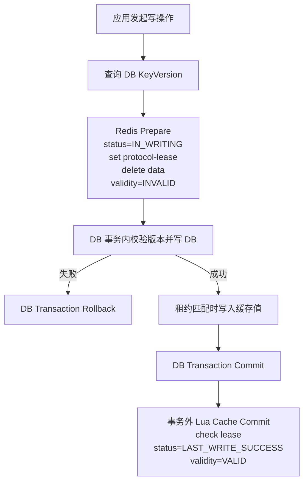
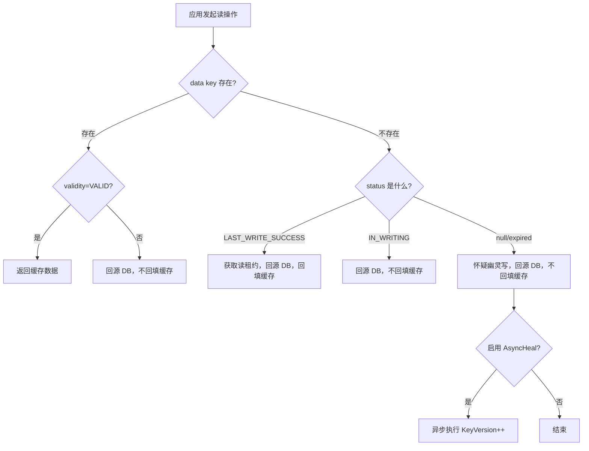

# 使用文档

## 1. 核心概念

这个项目围绕四个角色工作：

- `ConsistencyClient<T>`：统一读写入口
- `RedisAccessor`：Redis 协议执行层
- `PersistentOperation<T>`：业务持久层适配接口
- `ConsistencySettings`：协议参数配置

如果你的写链路需要把“版本查询 + DB 写入”放进同一事务，应实现 `TransactionalPersistentOperation<T>`，而不是只实现普通 `PersistentOperation<T>`。

## 2. 协议原理

这个方案不是普通的 Cache Aside，而是一个带协议状态机的“类两阶段提交”流程。

写路径分三段：

1. `Prepare`
   - 先执行第一段 Redis Lua
   - `status=IN_WRITING`
   - `validity=INVALID`
   - 删除旧缓存
   - 设置写租约
2. `DB Commit`
   - 在业务方自己的 DB 事务内校验 `KeyVersion`
   - 更新数据库
   - 租约匹配时写入新缓存值
3. `Cache Commit`
   - DB 事务提交后执行第二段 Redis Lua
   - 再次检查租约
   - `status=LAST_WRITE_SUCCESS`
   - `validity=VALID`

这里说的三段，是协议调用顺序，不是 Redis 和 DB 共享同一个分布式事务。

其中 `validity` 可以理解为缓存的“提交位”。只有 DB 真正提交成功后，缓存才会重新变成有效。

这也是它规避脏读的关键：

- 如果 DB 回滚，`Cache Commit` 不会发生
- 因而 `validity` 不会回到 `VALID`
- 读流程就不会把缓存当成可信数据

### 2.1 写流程图



### 2.2 读流程图



### 2.3 幽灵写是什么

“幽灵写”指的是：

- 请求已经对客户端超时
- 但底层并没有真正结束
- 它仍可能在网络、线程池或数据库内部阻塞
- 未来某个时刻继续执行旧写入

对应处理方式：

- 防御：正式写入必须校验 `KeyVersion`
- 治疗：当读流程发现 `status=null/expired` 时，可选触发 `AsyncHeal`
- `AsyncHeal` 只做 `KeyVersion++`，不修改业务数据

这样迟到的旧写请求最终落到 DB 时，会因为持有过期版本而被拒绝。

### 2.4 Redis 故障时的边界

这套协议不是“Redis 挂了就统一降级到 DB”。需要分读写来看：

- 读路径：允许有限降级
- 写路径：默认不允许绕过协议

读路径为什么能降级：

- 如果 Redis 数据 key / 状态 key 读取失败，`ConsistencyClient.get()` 可以在 `FailoverStrategy` 允许时直接读 DB
- 这时损失的是缓存命中和一部分性能，而不是协议安全性

写路径为什么不能直接降级成“只写 DB”：

- 写协议必须先执行 Redis `Prepare`
- `Prepare` 要原子建立 `status=IN_WRITING`、`validity=INVALID`、`protocol-lease`，并删除旧缓存
- 如果这一段失败，却仍继续写 DB，后续读请求就可能在没有协议保护的情况下读到旧缓存

所以写路径的规则是：

- Redis `Prepare` 失败：写请求直接失败
- DB 已成功，但 `stageCacheValue` / `finalizeWrite` 出错：主路径失败
- 只有 `finalizeWrite()` 失败这一种情况，才可以通过可选 compensation 扩展做异步缓存修复

也就是说，这套系统的默认取向是：

- 读故障时偏可用
- 写故障时偏一致性安全

如果你启用了 compensation，要注意它也不是“写路径降级成功”：

- 它只适用于“DB 已提交，但 finalize 失败”
- 它修复的是缓存侧状态，不会改变 DB 结果
- 不启用 `FinalizeFailureHandler` 时，默认仍然直接报错

## 3. 典型接入步骤

### 3.1 创建 Redis 适配器

```java
RedisClient redisClient = RedisClient.create("redis://127.0.0.1:6379");
StatefulRedisConnection<byte[], byte[]> connection = LettuceRedisAccessor.connect(redisClient);
RedisAccessor redisAccessor = new LettuceRedisAccessor(connection);
```

### 3.2 实现持久层接口

```java
public final class UserProfileOperation implements TransactionalPersistentOperation<String> {
    private final JdbcTemplate jdbcTemplate;
    private final TransactionTemplate transactionTemplate;

    public UserProfileOperation(JdbcTemplate jdbcTemplate, TransactionTemplate transactionTemplate) {
        this.jdbcTemplate = jdbcTemplate;
        this.transactionTemplate = transactionTemplate;
    }

    @Override
    public OperationResult<String> read(ConsistencyContext context) {
        String value = jdbcTemplate.queryForObject(
                "select profile_json from user_profile where user_id = ?",
                String.class,
                context.getKey()
        );
        return OperationResult.success(value);
    }

    @Override
    public OperationResult<String> queryVersion(ConsistencyContext context) {
        String version = jdbcTemplate.queryForObject(
                "select key_version from user_profile where user_id = ?",
                String.class,
                context.getKey()
        );
        return OperationResult.success(version);
    }

    @Override
    public OperationResult<Void> update(ConsistencyContext context) {
        int updated = jdbcTemplate.update(
                "update user_profile set profile_json = ?, key_version = key_version + 1 " +
                        "where user_id = ? and key_version = ?",
                context.getValue(),
                context.getKey(),
                Long.valueOf(context.getVersion())
        );
        return updated == 1
                ? OperationResult.success()
                : OperationResult.versionRejected();
    }

    @Override
    public OperationResult<Void> delete(ConsistencyContext context) {
        int deleted = jdbcTemplate.update(
                "delete from user_profile where user_id = ? and key_version = ?",
                context.getKey(),
                Long.valueOf(context.getVersion())
        );
        return deleted == 1
                ? OperationResult.success()
                : OperationResult.versionRejected();
    }

    @Override
    public <R> R executeInTransaction(ConsistencyContext context, TransactionCallback<R> callback) {
        return transactionTemplate.execute(status -> callback.doInTransaction());
    }
}
```

### 3.3 创建客户端

```java
ConsistencyClient<String> client = new DefaultConsistencyClient<>(
        redisAccessor,
        new UserProfileOperation(jdbcTemplate, transactionTemplate),
        StringSerializer.UTF8,
        ConsistencySettings.builder()
                .keyPrefix("user-profile")
                .leaseTtlSeconds(3)
                .writeLockTtlSeconds(5)
                .retryBackoffMillis(50)
                .ghostWriteHealingEnabled(true)
                .build()
);
```

如果你使用 Spring Boot，也可以不手工创建客户端，直接引入 `consistency-spring` 并提供 `RedisAccessor`、`PersistentOperation<T>`、`Serializer<T>` 这三个 bean，由自动配置生成 `ConsistencyClient<T>`。

```properties
cck.key-prefix=user-profile
cck.lease-ttl-seconds=3
cck.write-lock-ttl-seconds=5
cck.retry-backoff-millis=50
cck.batch-parallelism=4
cck.ghost-write-healing-enabled=true
cck.metrics.enabled=true
```

其中 `cck.batch-parallelism` 用来控制 `getAll/setAll/deleteAll` 的批量并发度。它并不会把协议变成多 key 原子事务，只是并发执行多个单 key 协议实例。

如果你希望批量接口真正减少 DB/Redis 往返，而不只是并发执行单 key，可以额外实现：

- `BatchPersistentOperation<T>`
- `BatchRedisAccessor`

启用后：

- `getAll()` 会优先走批量缓存读取、批量回源、批量回填
- `setAll()/deleteAll()` 会优先走批量版本查询、批量 DB 更新/删除

如果同一批写删请求里的每个 item 需要不同的 `expectedVersion`、不同 attachment，使用：

- `setAllWithContexts(Collection<BatchSetCommand<T>>, ttl, defaultContext)`
- `deleteAllWithContexts(Collection<BatchDeleteCommand>, defaultContext)`

`defaultContext` 适合放批次公共信息，例如 trace id；每个 item 的 context 可以单独覆盖 `version`，并补充自己的 attachment。

### 3.4 可选：接入 finalize 失败补偿

补偿模块不是默认主路径的一部分。只有在你希望处理这种场景时才需要启用它：

- DB 写入已经成功
- Redis `finalizeWrite()` 收尾失败
- 你希望把缓存修复动作异步重试，而不是让默认协议直接包含补偿逻辑

先引入 `consistency-compensation`：

```xml
<dependency>
  <groupId>io.github.cache-consistency-kit</groupId>
  <artifactId>consistency-compensation</artifactId>
  <version>0.1.0-SNAPSHOT</version>
</dependency>
```

手工创建客户端时，显式传入 `FinalizeFailureHandler`：

```java
CompensationTaskStore taskStore =
        new FileCompensationTaskStore(Paths.get("runtime/cck-compensation.log"));

CompensationExecutor compensationExecutor = new AsyncCompensationExecutor(
        redisAccessor,
        3,
        500L,
        taskStore,
        ConsistencyObserver.NoOpConsistencyObserver.INSTANCE
);

DefaultConsistencyClient<String> client = new DefaultConsistencyClient<>(
        redisAccessor,
        new UserProfileOperation(jdbcTemplate, transactionTemplate),
        StringSerializer.UTF8,
        ConsistencySettings.builder()
                .keyPrefix("user-profile")
                .leaseTtlSeconds(3)
                .writeLockTtlSeconds(5)
                .retryBackoffMillis(50)
                .ghostWriteHealingEnabled(true)
                .build(),
        ConsistencyObserver.NoOpConsistencyObserver.INSTANCE,
        GhostWriteHealer.NoOpGhostWriteHealer.INSTANCE,
        new CompensationFinalizeFailureHandler(compensationExecutor)
);
```

这样只有在 `finalizeWrite()` 失败时，才会调度缓存补偿：

- `set()`：异步重试写缓存
- `delete()`：异步重试删缓存

此时返回结果会变成更明确的补偿态：

- `STORE_UPDATED_CACHE_REPAIR_SCHEDULED`
- `DELETED_CACHE_REPAIR_SCHEDULED`

如果你希望进程重启后继续执行未完成任务，可以在启动时调用一次：

```java
((AsyncCompensationExecutor) compensationExecutor).replayPending();
```

如果使用 Spring Boot，自动配置本身不会默认启用补偿。你需要自己提供这两个 bean：

```java
@Bean
public CompensationExecutor compensationExecutor(RedisAccessor redisAccessor,
                                                 ConsistencyObserver observer) {
    AsyncCompensationExecutor executor = new AsyncCompensationExecutor(
            redisAccessor,
            3,
            500L,
            new FileCompensationTaskStore(Paths.get("runtime/cck-compensation.log")),
            observer
    );
    executor.replayPending();
    return executor;
}

@Bean
public FinalizeFailureHandler finalizeFailureHandler(CompensationExecutor compensationExecutor) {
    return new CompensationFinalizeFailureHandler(compensationExecutor);
}
```

或者直接使用 `consistency-spring` 的属性自动装配：

```properties
cck.compensation.enabled=true
cck.compensation.max-retries=3
cck.compensation.retry-delay-millis=500
cck.compensation.store-path=runtime/cck-compensation.log
cck.compensation.replay-pending-on-startup=true
```

注意事项：

- 不提供 `FinalizeFailureHandler` bean，就不会启用补偿
- `FileCompensationTaskStore` 只是一个简单文件实现，生产环境可以换成你自己的持久化实现
- 补偿只负责缓存侧修复，不改变 DB 已提交结果
- 指标里的 `cck.compensation.scheduled/success/failure` 只有启用补偿后才有意义
- `cck.compensation.pending` 表示当前待回放或待重试的补偿任务数

## 4. 常用 API

### 4.1 读取

```java
ReadResult<String> result = client.get(
        "user:1001",
        Duration.ofMinutes(10),
        ConsistencyContext.create()
);
```

### 4.2 带版本写入

```java
WriteResult result = client.set(
        "user:1001",
        "{\"name\":\"alice\"}",
        Duration.ofMinutes(10),
        ConsistencyContext.create().withVersion("17")
);
```

### 4.3 带版本删除

```java
WriteResult result = client.delete(
        "user:1001",
        ConsistencyContext.create().withVersion("18")
);
```

### 4.4 写结果状态说明

- `STORE_AND_CACHE_UPDATED`：DB 和缓存都已在主路径成功
- `STORE_UPDATED_CACHE_REPAIR_SCHEDULED`：DB 已提交，但缓存 finalize 失败，已转入补偿修复
- `DELETED`：删除主路径已完成
- `DELETED_CACHE_REPAIR_SCHEDULED`：删除已提交，但缓存 finalize 失败，已转入补偿修复
- `VERSION_REJECTED`：版本校验失败
- `WRITE_LOCK_BUSY`：当前 key 正在写窗口内

## 5. 配置建议

- `keyPrefix`：不同业务必须隔离，避免协议 key 冲突
- `leaseTtlSeconds`：控制读租约时长，通常为 1 到 5 秒
- `writeLockTtlSeconds`：必须覆盖单次写事务和事务外 Lua 收尾时间
- `retryBackoffMillis`：读租约未拿到时的重试退避
- `batchParallelism`：批量接口的并发度，默认 1，建议从 2 到 8 按业务压测结果调整
- `ghostWriteHealingEnabled`：是否启用幽灵写异步治疗
- 观测上建议同时关注：`cck.finalize.failure`、`cck.ghost_heal.*`、`cck.compensation.*`

另外还有两个很关键但容易被忽视的约束：

- `status` / `validity` 的 TTL 必须大于业务 `data` 的 TTL
- `IN_WRITING` 的 TTL 必须大于数据库访问超时时间

否则读侧可能误判状态，引发不必要的幽灵写治疗，甚至错误打断合法写请求。

## 6. 什么时候实现 `VersionHealingOperation`

如果你启用了 `ghostWriteHealingEnabled=true`，建议同时提供一个 `VersionHealingOperation` 并通过 `AsyncGhostWriteHealer` 注入客户端。这个治疗动作只做版本推进，不修改业务字段。

## 7. 如何查看协议状态

如果你要排查某个业务 key 当前是否处于写窗口、是否缓存可读、是否怀疑存在幽灵写，不需要手动拼 Redis key。

```java
ProtocolInspector inspector = new RedisProtocolInspector(redisAccessor, "user-profile");
ProtocolSnapshot snapshot = inspector.snapshot("user:1001");

snapshot.getState();
snapshot.getValidity();
snapshot.isCacheReadable();
snapshot.isGhostWriteSuspected();
```

如果你需要直接输出日志或 debug 接口，而不是自己解释快照，可以继续用诊断器：

```java
ProtocolDiagnostician diagnostician = new DefaultProtocolDiagnostician(inspector);
ProtocolDiagnosis diagnosis = diagnostician.diagnose("user:1001");

diagnosis.getSummary();
diagnosis.getRecommendedAction();
diagnosis.format();
```

## 8. 不建议的接入方式

- 不要在 `update()` 里无条件覆盖写入而不校验版本
- 不要把多个业务共用同一个 `keyPrefix`
- 不要把缓存 TTL 设置得远大于业务允许的陈旧窗口
- 不要让 `status` / `validity` 比业务 `data` 更早过期
- 不要让 `IN_WRITING` TTL 小于 DB 超时时间
- 不要绕开 `ConsistencyClient` 直接对协议 key 做业务写入
- 不要在开启 `ghostWriteHealingEnabled` 时遗漏 `VersionHealingOperation` 实现
