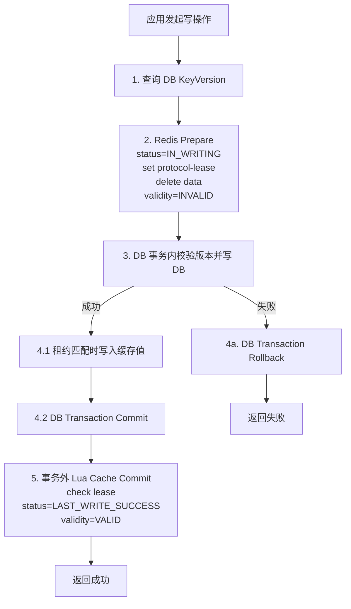
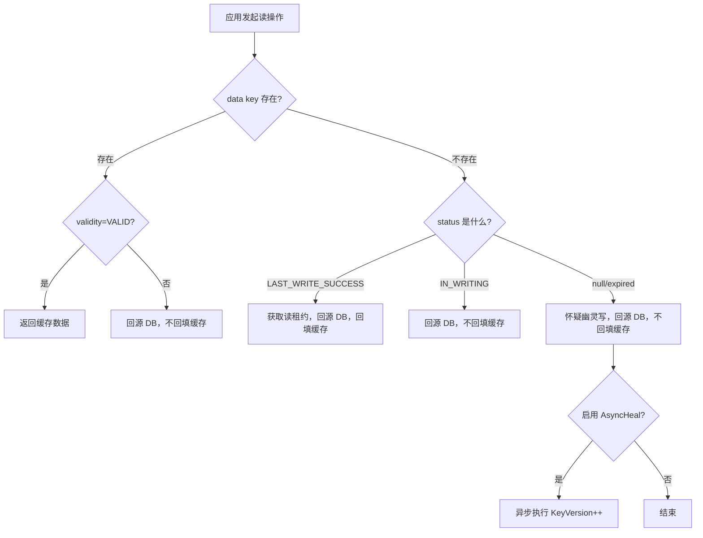

# 设计思路说明

## 设计目标

这个项目不是简单的“Cache Aside 封装”，而是要把一套可开源、可复用、可验证的缓存一致性协议还原出来。

目标是：

- 用 Redis 显式表达写状态机
- 用版本号对抗并发覆盖和幽灵写
- 用标准 Java 接口抽象 DB 事务与业务持久层
- 去掉所有企业私有中间件依赖

## 核心抽象

- `ConsistencyClient`：统一的读、写、删入口
- `PersistentOperation`：业务持久层最小接口
- `TransactionalPersistentOperation`：把版本查询和 DB 写入放到同一事务中的扩展接口
- `VersionHealingOperation`：幽灵写治疗接口，只推进版本
- `RedisAccessor`：协议层 Redis 命令抽象

## 为什么不是普通 Cache Aside

普通 Cache Aside 只表达“先写 DB 再删缓存”或“读 miss 再回填”，但无法清晰描述：

- 写事务执行中缓存是否可信
- 迟到写请求如何被拒绝
- 读请求如何识别无效缓存
- 缓存 key 不存在时是否可能是幽灵写

这个项目把这些状态显式放进 Redis：

- `data`：业务缓存值
- `status`：协议写状态
- `validity`：当前缓存是否可读
- `lease`：读侧租约
- `protocol-lease`：写侧协议租约

## 写路径设计

写路径遵循“两阶段 Lua + 版本校验”的协议。它不是简单的“先写 DB 再删缓存”，而是一个带事务边界的类两阶段提交流程。

这里的“类两阶段提交”强调的是协议顺序，不表示 Redis 和 DB 进入了同一个分布式事务。

### 写路径的三个阶段

1. `Prepare` 阶段
   - 先执行第一段 Redis Lua
   - 设置 `status=IN_WRITING`
   - 设置 `protocol-lease`
   - 删除旧 `data`
   - 设置 `validity=INVALID`
2. `DB Commit` 阶段
   - 在业务方自己的 DB 事务内校验 `KeyVersion`
   - 写入 DB
   - 在租约仍匹配时写入新缓存值
   - 提交事务
3. `Cache Commit` 阶段
   - DB 事务提交后执行第二段 Redis Lua
   - 再次校验租约
   - 设置 `status=LAST_WRITE_SUCCESS`
   - 如果缓存值存在，则设置 `validity=VALID`
   - 释放 `protocol-lease`

这里的 `validity` 可以看作缓存协议中的“提交标记”。只有当数据库事务真的提交成功，缓存才会被标记成有效。

### 为什么事务回滚不会造成脏读

这个方案真正精妙的地方，不在“写成功怎么回填”，而在“写失败或回滚时缓存怎么保持安全”。

- `Prepare` 已经把缓存切到了 `IN_WRITING + INVALID`
- 如果 DB 事务回滚，事务外的 `Cache Commit` 永远不会执行
- 因此 `validity` 不会回到 `VALID`
- 读流程即使看到缓存值，也不会把它当成合法命中

这意味着缓存逻辑状态会和数据库的回滚结果保持一致，不会出现“DB 已回滚，但缓存还被当成有效值”的情况。

### 写流程图

这样写窗口里的旧缓存不会继续被当成有效值读取。

## 读路径设计

读路径是一个基于协议元数据的状态机，优先级是“宁可多回源，也不读脏数据”。

### 读状态机

1. `data` 存在且 `validity=VALID`
   - 直接返回缓存
2. `data` 存在但 `validity=INVALID`
   - 回源 DB，不回填缓存
3. `data` 不存在
   - `status=LAST_WRITE_SUCCESS`
     - 说明当前不是写窗口，按正常 miss 处理
     - 读侧获取租约，回源 DB，再回填缓存
   - `status=IN_WRITING`
     - 说明当前处于写窗口
     - 只回源 DB，不回填缓存
   - `status=null/expired`
     - 说明协议元数据已经丢失或过期
     - 系统将其视为“可能存在幽灵写”
     - 只回源 DB，不回填缓存
     - 可选触发 `AsyncHeal`

### 读流程图

## 幽灵写设计

“幽灵写”指已经超时、但底层链路可能仍会继续执行的旧写请求。

这个读流程不仅保持一致性，还具备消灭幽灵写的能力。

### 幽灵写的定义

- 请求在客户端视角已经超时
- 但请求并没有真正结束，仍可能在网络、线程池、数据库连接或数据库内部阻塞
- 未来某个时刻它可能“复活”并继续执行旧写入

### 幽灵写的防御与治疗

防御：

- 防御：所有正式写入都要校验 `KeyVersion`

治疗：

- 读路径发现 `status=null/expired` 时，认为“可能存在幽灵写”
- 如果开关打开，就触发一次 `AsyncHeal`
- `AsyncHeal` 的动作不是修业务数据，而是只做一次 `KeyVersion++`

治疗动作不修改业务字段，只推进版本号。这样迟到的旧写请求即使最终抵达数据库，也会因为版本过期而失败。

## 安全性证明

为了说明这套协议为什么安全，可以把它写成一个核心不变性。

### 状态定义

- `DB(k)`：数据库中键 `k` 的权威值
- `C(k)`：缓存中键 `k` 的业务数据
- `C(k).status`：缓存协议状态
- `C(k).validity`：缓存可读性标记

### 核心安全不变性

若 `C(k).status == LAST_WRITE_SUCCESS` 且 `C(k).validity == VALID`，则必有 `C(k) == DB(k)`。

也就是：

- 只要系统把一份缓存标成“写成功且有效”
- 这份缓存就必须等于数据库权威值

### 为什么这个不变性始终成立

初始状态：

- 缓存为空
- `status` 和 `validity` 都不存在
- 不变性的前提不成立，因此天然安全

读操作：

- 读流程不会主动把一份不安全的数据标记成 `LAST_WRITE_SUCCESS + VALID`
- 因而不会破坏不变性

写操作：

- `Prepare` 阶段先把 `validity` 设成 `INVALID`
- 此时即使缓存里有数据，也不满足不变性的前提
- 真正能把 `status` 和 `validity` 同时切到“成功 + 有效”的唯一地方，是 `Cache Commit`
- 而 `Cache Commit` 只会发生在 DB 写成功之后
- 所以一旦缓存被重新标记为有效，它携带的就是刚刚成功写入数据库的值

事务回滚：

- 回滚后 DB 保持旧值
- `Prepare` 已经让 `validity=INVALID`
- `Cache Commit` 不会执行
- 因此缓存不会重新变成“成功 + 有效”

结论：

- 系统不会返回一份“被标记为有效、但实际已经过时”的缓存数据

## 协议成立的约束条件

这套证明成立，依赖以下三条技术约束：

### 约束 1：Lua 原子性

- `Prepare` 阶段 Lua 必须原子执行
- `Cache Commit` 阶段 Lua 也必须原子执行

否则可能出现：

- `status=IN_WRITING` 已设置
- 但 `validity` 还保留着上一次的 `VALID`

这会直接破坏读状态机的判断前提。

### 约束 2：元数据生命周期

- `status` 和 `validity` 的 TTL 必须大于业务 `data` 的 TTL

否则业务数据还在，协议元数据先过期，读侧就可能误判为“可能存在幽灵写”，从而产生不必要的 `AsyncHeal` 和额外版本推进。

### 约束 3：`IN_WRITING` TTL 必须大于 DB 超时时间

- `IN_WRITING` 的 TTL 必须覆盖一次正常的数据库访问和事务提交时间

否则会出现：

- 合法写请求仍在执行
- 但 `IN_WRITING` 已先过期
- 读请求误以为存在幽灵写并触发 `AsyncHeal`
- 导致原始合法写因为版本变化而失败

## 开源化时保留和删除的东西

保留：

- 协议状态机思想
- 两阶段 Lua
- 版本号并发控制
- 幽灵写治疗
- 事务边界抽象

删除：

- 私有 Redis 客户端包装
- 私有配置中心
- 私有指标和治理框架
- 企业命名、包名和文档术语

## 当前实现边界

当前实现已经具备生产基线所需的主路径能力，但仍保持开源库应有的克制：

- 默认支持单 key 协议主路径
- 提供批量入口，但不是多 key 原子协议
- 可选保留观测扩展；补偿已移到独立模块，不是默认正确性的基础
- 需要业务方自己提供符合语义的 DB 事务实现
